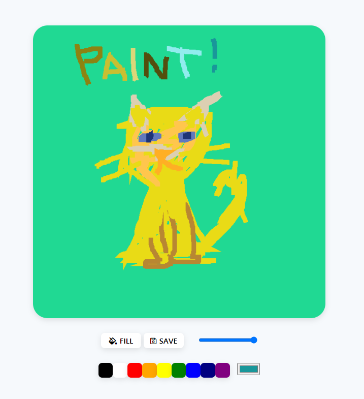

# js-paint
 HTML_canva prcatice
 
 
<ul>
 <li>drawing size change</li>
 <li>color change with pallete</li>
 <li>color choiced change</li>
 <li>save file with random emoji</li>
 </ul>
 
 short cut
  https://jinnyk015.github.io/js-paint/
